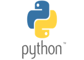
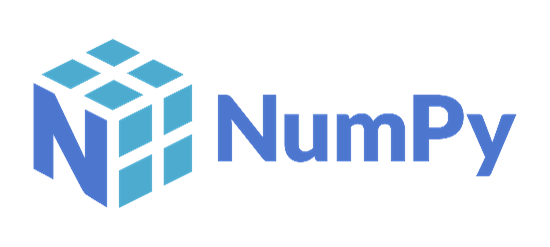
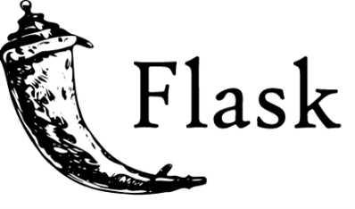
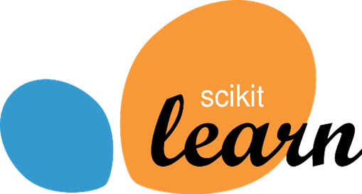

# Taxi Fare Prediction
use this link to check your insurance premium
https://public-transport-fares-prediction.onrender.com/

# Table of Contents
- [Demo](#demo)
- [Overview](#overview)
- [Project Goal](#project-goal)
- [Technical Aspects](#technical-aspects)
- [Installation](#installation)
- [Feature Request](#feature-request)
- [Used Technologies](#used-technologies)
- [Appendix](#appendix)
- [FAQ](#faq)
- [Author](#author)
- [License](#license)
- [Feedback](#feedback)

## Demo 

- Link for web application: https://www.youtube.com/watch?v=E2EwPNBePIA

## Overview 
- Overview of the web application.

## Project Goal 
This complete project is made as a part of PG Diploma in Big Data Analytics as a final Project at C-DAC HYDERABAD.

## Technical Aspects 
The whole project has been divided into three parts. These are listed as follows :

**Data Preparation**: This consists of storing our data into mongoDB database and utilizing it, Data Cleaning, Feature Engineering, Feature Selection, EDA, etc.

• 𝐌𝐨𝐝𝐞𝐥 𝐃𝐞𝐯𝐞𝐥𝐨𝐩𝐦𝐞𝐧𝐭 : In this step, we use the resultant data after the implementation of the previous step to cross validate our Machine Learning model and perform Hyperparameter optimization based on various performance metrics in order to make our model predict as accurate results as possible.

• 𝐌𝐨𝐝𝐞𝐥 𝐃𝐞𝐩𝐥𝐨𝐲𝐦𝐞𝐧𝐭 : This step include creation of a front-end using HTML,CSS, and using Flask API back-end and deployed it on local host.

## Installation 
- Instructions for installation

## Feature Request 
If you find a bug (the website couldn't handle the query and / or gave undesired results), kindly email me (deepankarpawar11@gmail.com) by including your search query and the expected result.

If you'd like to request a new function, feel free to do so by opening an issue here. Please include sample queries and their corresponding results.

## Used Technologies 

## Appendix 
- Additional information.

## FAQ 
- Frequently asked questions.

## Author 
- Deepankar Pawar\
  I am writing to introduce myself—Deepankar Pawar—a talented individual with a profound passion for the field of data science. I am not just a data enthusiast; I am a dedicated practitioner and a fervent advocate for 
  the intersection of technology and data-driven insights.

  I have demonstrated exceptional expertise in the realms of data science, deep learning, and artificial intelligence (AI). My commitment to staying at the forefront of these rapidly evolving fields is evident in my 
  continuous pursuit of knowledge and skills. Whether it's crafting sophisticated machine learning models, delving into the intricacies of deep learning algorithms, or exploring the frontiers of AI, I approach each 
  challenge with enthusiasm and a deep analytical mindset.

  What sets me apart is not only my technical proficiency but also my keen interest in deploying data-driven solutions in real-world scenarios. My ability to bridge the gap between theory and application, coupled with a 
  focus on effective deployment strategies, makes me a valuable asset in any data-centric project.

  In addition to my technical skills, I am a collaborative team member, always eager to share my insights and learn from others.

  I am confident that my passion for data science and my expertise in AI and deep learning can make a meaningful impact in any project or collaboration. I look forward to the opportunity to discuss how I can contribute 
  to your team.
  
  Thank You

## License 
[MIT](https://choosealicense.com/licenses/mit/)

Copyright 2023 Deepankar Pawar

Permission is hereby granted, free of charge, to any person obtaining a copy of this software and associated documentation files (the "Software"), to deal in the Software without restriction, including without limitation the rights to use, copy, modify, merge, publish, distribute, sublicense, and/or sell copies of the Software, and to permit persons to whom the Software is furnished to do so, subject to the following conditions:

The above copyright notice and this permission notice shall be included in all copies or substantial portions of the Software.

THE SOFTWARE IS PROVIDED "AS IS", WITHOUT WARRANTY OF ANY KIND, EXPRESS OR IMPLIED, INCLUDING BUT NOT LIMITED TO THE WARRANTIES OF MERCHANTABILITY, FITNESS FOR A PARTICULAR PURPOSE AND NONINFRINGEMENT. IN NO EVENT SHALL THE AUTHORS OR COPYRIGHT HOLDERS BE LIABLE FOR ANY CLAIM, DAMAGES OR OTHER LIABILITY, WHETHER IN AN ACTION OF CONTRACT, TORT OR OTHERWISE, ARISING FROM, OUT OF OR IN CONNECTION WITH THE SOFTWARE OR THE USE OR OTHER DEALINGS IN THE SOFTWARE.

## Feedback 
If you have any feedback, please reach out to me at deepankarpawar11@gmail.com

